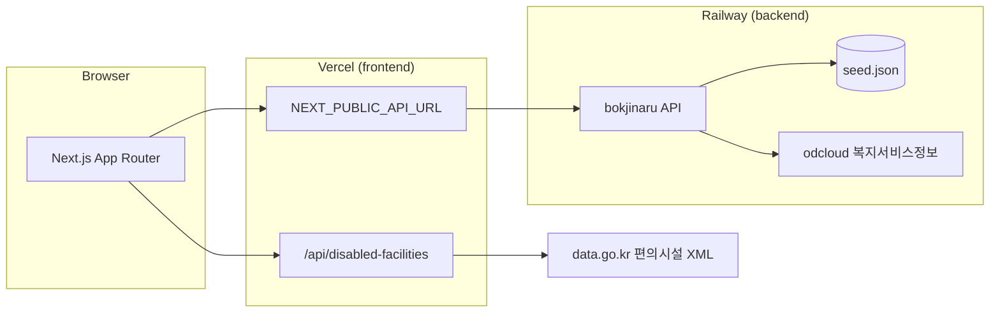

# 복지나루 (Bokjinaru)

장애인·보호자·복지 정보 탐색자를 위한 **공공 복지서비스 통합 안내** 웹 애플리케이션입니다.  
장애유형·연령·지역·지원 분야로 복지 서비스를 찾고, 담당 기관과 장애인 편의시설 정보를 한곳에서 확인할 수 있습니다.

| 구분 | 스택 | 배포 |
|------|------|------|
| 프론트엔드 | Next.js 15 · React 19 · TypeScript · Zustand | [Vercel](https://vercel.com) (`frontend/`) |
| 백엔드 | Spring Boot 3 · Java 17 | [Railway](https://railway.app) (`backend/`) |

---

## 주요 기능

### 복지 서비스 안내
- **서비스 찾기** (`/search`) — 장애유형, 연령, 지역, 지원 분야, 키워드 필터
- **서비스 상세** (`/services/[id]`) — 지원 내용, 대상, 신청 방법, 관련 링크
- **지원 기관** (`/organizations`) — 기관 목록·상세
- **홈** — 추천 서비스, 이용 단계, 통계 요약

### 장애인 편의시설 (공공데이터)
- **편의시설 찾기** (`/disabled-facilities`) — [한국사회보장정보원_장애인편의시설 현황](https://www.data.go.kr) OpenAPI 연동
- 시설 목록 검색 → `wfcltId` 기준 **기구표(평가 항목)** 상세 조회
- 공공 API는 **Next.js Route Handler**에서 XML을 파싱해 JSON으로 제공 (인증키 서버 전용)

### 접근성·안정성
- **접근성 안내** (`/accessibility`) — 색 대비, 키보드, 스크린리더, 모션 절제
- API 장애 시 **예시 데이터 폴백** + 안내 배너 (로그인은 폴백 없음)
- 데모 로그인: `demo` / `demo1234` → 마이페이지·문서 초안

---

## 아키텍처



| 데이터 | 출처 | 비고 |
|--------|------|------|
| 복지 서비스·기관 | Spring API | `ODCLOUD_SERVICE_KEY` 있으면 공공 복지서비스 목록, 없으면 `seed.json` 8건 |
| API 실패 시 UI | `frontend/app/lib/mock-data.ts` | 노란 「예시 데이터」 배너 표시 |
| 편의시설 | `apis.data.go.kr` | `DATA_GO_KR_SERVICE_KEY`, 프론트 서버 프록시 |

---

## 저장소 구조

```
├── frontend/                 # Next.js (App Router)
│   ├── app/                    # 페이지·컴포넌트·API 라우트
│   ├── lib/apis/               # 편의시설 공공 API (XML → JSON)
│   └── app/services/           # 백엔드 REST 클라이언트·폴백
├── backend/
│   ├── app/bokjinaru/          # ★ 실제 API (Spring Boot)
│   ├── docker/Dockerfile       # Railway 빌드
│   └── RAILWAY.md
├── docs/                       # 아키텍처·논문/개발 메모
├── DEPLOY.md                   # Vercel·Railway 배포 상세
└── README.md
```

> `backend/app/paperdot`은 초기 스텁입니다. 배포·개발은 **`bokjinaru`** 만 사용하세요.

---

## 페이지 맵

| 경로 | 설명 |
|------|------|
| `/` | 랜딩·빠른 검색·추천 서비스 |
| `/search` | 복지 서비스 검색 |
| `/services/[id]` | 서비스 상세 |
| `/organizations` | 지원 기관 목록 |
| `/organizations/[id]` | 기관 상세 |
| `/disabled-facilities` | 장애인 편의시설 검색·기구표 |
| `/accessibility` | 접근성 안내 |
| `/login` | 데모 로그인 |
| `/mypage` | 마이페이지 (로그인 필요) |
| `/newdocument` | 문서 초안 (로그인 필요) |

---

## 로컬 실행

### 1. 백엔드 (포트 8080)

```bash
# IDE: kr.welfareguide.BokjinaruApplication 실행
# 또는 backend/app/bokjinaru 에서 Gradle bootRun
```

`backend/app/.env` 예시:

```env
PORT=8080
WELFARE_CORS_ALLOWED_ORIGINS=http://localhost:3000
ODCLOUD_SERVICE_KEY=          # 선택: 공공 복지서비스정보
```

확인: http://localhost:8080/api/health  
→ `{"status":"ok","dataSource":"odcloud"|"seed"}`

### 2. 프론트엔드 (포트 3000)

```bash
cd frontend
npm install
cp .env.local.example .env.local   # Windows: copy .env.local.example .env.local
npm run dev
```

`frontend/.env.local` 예시:

```env
NEXT_PUBLIC_API_URL=http://localhost:8080
DATA_GO_KR_SERVICE_KEY=           # 편의시설 API (서버 전용)
```

확인: http://localhost:3000

### 3. 빌드 검증

```bash
cd frontend && npm run build
cd backend && docker build -f docker/Dockerfile .
```

---

## 환경 변수 요약

### Frontend (`frontend/.env.local`)

| 변수 | 필수 | 설명 |
|------|------|------|
| `NEXT_PUBLIC_API_URL` | ✅ | 백엔드 URL (끝 `/` 없음) |
| `DATA_GO_KR_SERVICE_KEY` | 편의시설용 | 공공데이터포털 인증키 (**클라이언트 노출 금지**) |

### Backend (`backend/app/.env` / Railway Variables)

| 변수 | 필수 | 설명 |
|------|------|------|
| `WELFARE_CORS_ALLOWED_ORIGINS` | ✅ | Vercel·로컬 origin (쉼표 구분) |
| `ODCLOUD_SERVICE_KEY` | 선택 | 복지서비스정보 API (없으면 seed) |
| `PORT` | Railway 자동 | 로컬 기본 8080 |

---

## 백엔드 API (요약)

| 메서드 | 경로 |
|--------|------|
| GET | `/api/health` |
| GET | `/api/v1/meta/filters` · `/stats` |
| GET | `/api/v1/services` · `/services/{id}` |
| GET | `/api/v1/organizations` · `/organizations/{id}` |
| POST | `/api/v1/auth/demo-login` |
| GET | `/api/v1/auth/me` |

상세: [backend/app/bokjinaru/README.md](./backend/app/bokjinaru/README.md)

## 프론트 프록시 API (편의시설)

| 메서드 | 경로 |
|--------|------|
| GET | `/api/disabled-facilities` — 목록 (`faclNm`, `siDoNm`, `pageNo` 등) |
| GET | `/api/disabled-facilities/[wfcltId]` — 기구표 상세 |

---

## 배포

| 서비스 | Root Directory | 문서 |
|--------|----------------|------|
| Vercel | `frontend` | [DEPLOY.md](./DEPLOY.md) · [frontend/README.md](./frontend/README.md) |
| Railway | `backend` | [backend/RAILWAY.md](./backend/RAILWAY.md) |

Production 백엔드 URL 예: `https://bokjinaru-production.up.railway.app`  
Vercel `NEXT_PUBLIC_API_URL`과 Railway `WELFARE_CORS_ALLOWED_ORIGINS`를 **서로 맞춰** 설정하세요.

---

## 문서

| 문서 | 내용 |
|------|------|
| [docs/ARCHITECTURE.md](./docs/ARCHITECTURE.md) | 레이어·확장 방향 |
| [docs/THESIS_DEV.md](./docs/THESIS_DEV.md) | 개발·실험 설계 |
| [docs/THESIS_LIMITATIONS.md](./docs/THESIS_LIMITATIONS.md) | 한계·향후 과제 |
| [docs/README.md](./docs/README.md) | 문서 인덱스 |

---

## 로드맵 (요약)

- [ ] PostgreSQL 영속화·관리자
- [ ] OAuth 실연동 (`/api/auth/callback` 스텁 존재)
- [ ] 복지 서비스 ↔ 편의시설 지도·위치 연계
- [ ] 공공 API 장애유형·지역 메타데이터 정교 매핑

---

## 라이선스·데이터

공공데이터 이용 시 [공공데이터포털](https://www.data.go.kr) 이용약관·출처 표시 의무를 준수하세요.  
본 저장소 코드는 프로젝트/학습 목적의 MVP이며, **실제 신청·급여 판정은 반드시 공식 기관·복지로에서 확인**해야 합니다.
