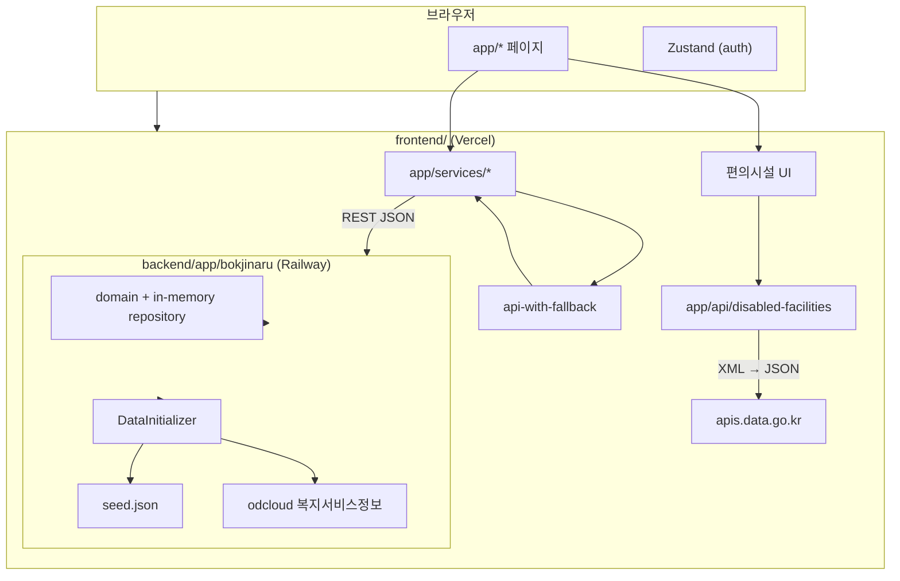

# 아키텍처

복지나루 모노레포의 레이어·데이터 흐름·확장 지점을 정리합니다.  
배포·환경 변수는 [DEPLOY.md](../DEPLOY.md), 프로젝트 개요는 [README.md](../README.md)를 참고하세요.

---

## 시스템 개요



| 경로 | 설명 |
|------|------|
| 복지 서비스·기관 | 브라우저 → Next.js → **bokjinaru API** |
| 장애인 편의시설 | 브라우저 → Next.js **Route Handler** → 공공 API (키는 서버만) |
| API 장애 시 | `mock-data.ts` + `MockDataBanner` (로그인 제외) |

> `backend/app/paperdot`은 초기 헬스체크 스텁입니다. 운영·개발은 **`bokjinaru`** 만 사용합니다.

---

## 프론트엔드 (`frontend/`)

### App Router

| 경로 | 유형 | 역할 |
|------|------|------|
| `app/page.tsx` | Server | 홈, 추천·통계 (`get*WithFallback`) |
| `app/search/page.tsx` | Client | 필터 검색 (`getServicesClientWithFallback`) |
| `app/services/[id]/page.tsx` | Server | 서비스 상세 |
| `app/organizations/**` | Server | 기관 목록·상세 |
| `app/disabled-facilities/page.tsx` | Server + Client | 편의시설 검색 UI |
| `app/login`, `mypage`, `newdocument` | Client | 데모 인증·보호 라우트 |

### API·데이터 계층

```
app/services/
├── http.ts              # fetch, localStorage 토큰
├── api.ts               # bokjinaru REST
└── api-with-fallback.ts # 실패 시 mock-data.ts

lib/apis/
├── disabledFacility.ts        # XML fetch·parse·normalize (서버 전용)
└── disabledFacility.types.ts

app/api/
├── disabled-facilities/route.ts           # 목록 프록시
├── disabled-facilities/[wfcltId]/route.ts # 기구표 상세 프록시
└── auth/callback/route.ts                 # OAuth 스텁 (501)
```

| 모듈 | 책임 |
|------|------|
| `app/lib/api-config.ts` | `NEXT_PUBLIC_API_URL` 정규화 |
| `app/lib/mock-data.ts` | API 불가 시 8건 예시 데이터 |
| `app/lib/mappers.ts` | 카드 UI용 DTO 변환 |
| `app/store/useAuthStore.ts` | 데모 로그인 상태 |

**설계 원칙**
- 공공 API `serviceKey`는 `DATA_GO_KR_SERVICE_KEY` 등 **서버 env만** 사용.
- 클라이언트는 `/api/disabled-facilities` 등 **자체 Route Handler**만 호출.
- 복지 서비스는 SSR/클라이언트 모두 `api-with-fallback`으로 빈 화면·에러만 노출하지 않음.

---

## 백엔드 (`backend/app/bokjinaru/`)

### 패키지 구조

```
kr.welfareguide/
├── controller/     # REST (/api/v1/*)
├── service/        # 검색·메타·인증
├── domain/         # WelfareService, Organization, enum
├── repository/     # ConcurrentHashMap (인메모리)
├── dto/            # API 응답
├── data/
│   ├── DataInitializer.java   # 기동 시 데이터 로드
│   └── DataSourceHolder.java  # seed | odcloud
├── integration/odcloud/       # 복지서비스정보 OpenAPI
└── config/                    # CORS, OdcloudProperties
```

### 기동 시 데이터 로드

1. `ODCLOUD_SERVICE_KEY` 설정 + API 성공 → **odcloud** 복지서비스 전량 적재 (`dataSource: odcloud`)
2. 실패·미설정 → `resources/data/seed.json` 8서비스·4기관 (`dataSource: seed`)

확인: `GET /api/health` → `{ "status": "ok", "dataSource": "..." }`

### REST API (요약)

| 영역 | 엔드포인트 |
|------|------------|
| 메타 | `GET /api/v1/meta/filters`, `/stats` |
| 서비스 | `GET /api/v1/services`, `/services/{id}` (쿼리 필터) |
| 기관 | `GET /api/v1/organizations`, `/organizations/{id}` |
| 인증 | `POST /api/v1/auth/demo-login`, `GET /api/v1/auth/me` |

검색 필터: `disabilityType`, `ageGroup`, `region`, `supportType`, `q`  
공공 데이터에 분류가 없을 때는 빈 taxonomy를 “전체 일치”로 처리합니다.

---

## 외부 연동

| API | 소비 주체 | 인증 env | 비고 |
|-----|-----------|----------|------|
| [복지서비스정보](https://www.data.go.kr/data/15083323/fileData.do) (odcloud) | 백엔드 | `ODCLOUD_SERVICE_KEY` | JSON, 페이지네이션 |
| [장애인편의시설 현황](https://www.data.go.kr) | 프론트 Route Handler | `DATA_GO_KR_SERVICE_KEY` | XML → `fast-xml-parser` |
| (폴백) `seed.json` / `mock-data.ts` | 각 레이어 | — | MVP·오프라인 UX |

---

## 배포 토폴로지

```
GitHub (main)
    ├── Vercel   root: frontend/   → NEXT_PUBLIC_API_URL
    └── Railway  root: backend/    → Dockerfile → bokjinaru.jar
              └── WELFARE_CORS_ALLOWED_ORIGINS ← Vercel origin
```

- 프론트 Region: `icn1` ([frontend/vercel.json](../frontend/vercel.json))
- CORS 미설정 시 `/search` 등 **클라이언트 fetch**만 실패할 수 있음 (SSR 페이지는 정상일 수 있음)

---

## 보안·운영

| 항목 | 현재 | 권장 |
|------|------|------|
| 인증 | 데모 계정 + 메모리 토큰 | OAuth2 + DB 세션 |
| API 키 | 서버 env | Vercel/Railway Secrets, 로테이션 |
| 저장소 | 인메모리 Map | PostgreSQL + JPA |
| 레이트 리밋 | 없음 | Route Handler·Spring 필터 |

---

## 확장 로드맵

1. **PostgreSQL** — `repository` 인터페이스 유지, 구현체만 교체  
2. **인증** — `app/api/auth/callback` 실구현, `AuthGuard` 연동  
3. **데이터 파이프라인** — 배치 동기화(복지로·지자체), 캐시(Redis)  
4. **지도** — 편의시설 `faclLat`/`faclLng` → 지도 컴포넌트  
5. **접근성 CI** — axe/playwright, `prefers-reduced-motion` 회귀 테스트  

---

## 관련 문서

| 문서 | 내용 |
|------|------|
| [THESIS_DEV.md](./THESIS_DEV.md) | 실험·개발 범위 |
| [THESIS_LIMITATIONS.md](./THESIS_LIMITATIONS.md) | 한계·가정 |
| [backend/app/bokjinaru/README.md](../backend/app/bokjinaru/README.md) | 백엔드 API·env |
